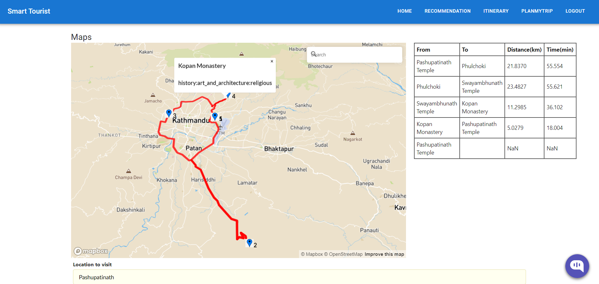

# Optimized Itinerary Recommendation using AI

With our lifestyle becoming busier by the day, our time to travel and explore the world outside our window has become more limited. And, even when we finally get the chance to pack our bags, we are presented with a more confusing problem: where to go? There are a lot of options on the Internet and the information might just overwhelm us. Even with the help of travel agencies and our own research, we can fail to make smart decisions at times and hence, end up not getting the full experience of the trip we deserved to enjoy. Some popular existing systems: *TripAdvisor, Welcome AI Itinerary App, Google Trips,* etc. have been providing travel recommendations. The order in which to visit the recommended sites is prominent in order to minimize the travel cost and traversal time which is absent in most of the existing systems. Furthermore, it targets tourist areas where there are lots of sites to travel to and tourists need to figure out the best route to visit all the sites that suit their preferences. Hence, we want to present a solution in the form of the application we're worked on: **"Optimized Itinerary Recommendation with AI"**.

## What exactly is it though? 

It is a system that recommends the optimized itinerary connecting the best destinations based on our travel preferences and overall statistics of the destinations. It is implemented on a user-friendly UI web platform integrated with map and  content-based, collaborative and hybrid filtering algorithms working behind the scenes to provide the best recommendations for the users. For the optimization of the routes, different approaches and heuristics such as Nearest Neighbor Heuristic, 2-opt, Dynamic Programming and Ant Colony Optimization are used and experimented upon. 2-opt and Ant Colony Optimization are observed to be suitable route optimization algorithms in  the production environment.

## What's inside the directories by the way ? 

**Datasets** : contains all the datasets used in our system

**Itinerary_recommender** : contains the implementation of route optimization techniques - Greedy (Nearest Neighbor Heuristic), Greedy improved with 2-opt technique, Dynamic Programming, Ant Colony Optimization 

**Recommender** : contains the notebooks for the implementation and evaluation of different recommendation algorithms - content based, collaborative filtering (KNN,ALS,SVD) and hybrid recommendation 

**Web_Application** : contains the code for the frontend (React) and backend (Djagno) implementation

**Web_scraping_plus_preprocessing** : contains scripts and notebooks used to scrape and preprocess the datasets

